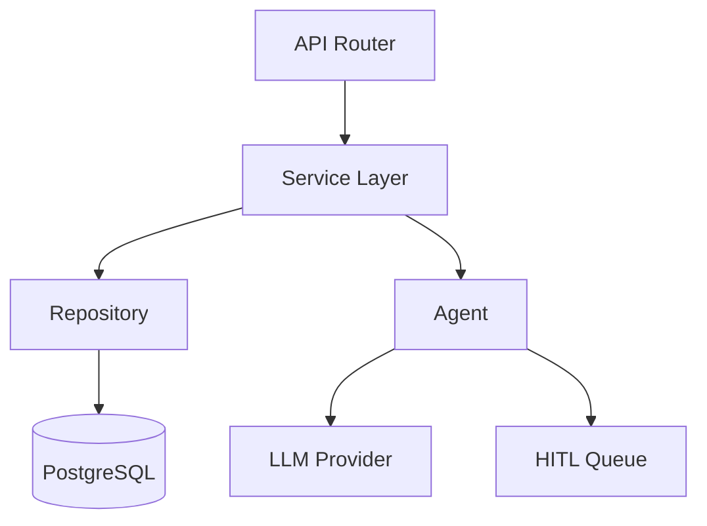

# Vastu — Architecture Skills

## Skill: Architecture Decision Record (ADR) Template

```markdown
## ADR-[NNN]: [Title]

**Status:** Proposed | Accepted | Deprecated | Superseded  
**Date:** YYYY-MM-DD  
**Deciders:** Vastu, Vishwa  

### Context
[Why is this decision needed? What problem does it solve?]

### Decision
[What is the change being proposed?]

### Options Considered

| Option | Pros | Cons |
|--------|------|------|
| A: [Name] | ... | ... |
| B: [Name] | ... | ... |
| C: [Name] | ... | ... |

### Consequences
- **Positive:** [Benefits of this decision]
- **Negative:** [Trade-offs and risks]
- **Risks:** [What could go wrong?]

### Related
- [Links to related ADRs, tickets, or documents]
```

## Skill: Multi-Tenant Architecture Checklist

For any new feature, verify:
- [ ] All database tables include `tenant_id` column (NOT NULL)
- [ ] RLS policy exists and is tested
- [ ] `app.current_tenant_id` is set before queries
- [ ] API endpoints extract tenant from JWT or header
- [ ] Agent deps include `tenant_id` in `AgentDeps`
- [ ] No shared state between tenants in cache/session
- [ ] Indexes include `tenant_id` for query performance
- [ ] Cross-tenant aggregation is impossible without admin role
- [ ] **Security gate**: Prahari reviews any new endpoint that crosses tenant or auth boundaries

## Skill: Threat Modeling (STRIDE)

For any new feature handling sensitive data or crossing trust boundaries, produce a STRIDE analysis before Karya writes code.

### STRIDE Template
```markdown
## Threat Model: [Feature Name]
**Date**: YYYY-MM-DD  
**Participants**: Vastu, Prahari, Vishwa

### Assets at Risk
| Asset | Sensitivity | Owner |
|---|---|---|
| Payment data | Critical | Tenant |
| JWT tokens | Critical | User |
| GL journal entries | High | Tenant |

### Trust Boundaries
1. Internet → FastAPI (public boundary)
2. FastAPI → Supabase (service boundary — service role key)
3. FastAPI → LLM Provider (agent boundary — external)
4. Tenant A data ↔ Tenant B data (RLS boundary)

### Threat Analysis
| Threat | STRIDE Category | Component | Likelihood | Impact | Mitigation |
|---|---|---|---|---|---|
| Token stolen via XSS | Spoofing | Auth | Medium | Critical | HttpOnly cookies, short expiry |
| SQL injection via RPC | Tampering | DB | Low | Critical | Parameterized queries only |
| Cross-tenant read | Info Disclosure | RLS | Low | Critical | RLS policies + app-layer filter |
| Agent prompt injection | Tampering | Agent | Medium | High | Input masking, output validation |
| Service key leaked | Elevation | Infra | Low | Critical | Env vars, gitleaks in CI |
| Unlimited agent run | DoS | Agent | Medium | High | Timeout, token budget per agent run |

### Mitigations Required Before Ship
- [ ] [Specific mitigation 1 — owner: Karya/Sthira/Rupa]
- [ ] [Specific mitigation 2]
```

### When to Trigger Threat Modeling
- New external integration (webhook, OAuth, third-party API)
- New agent with write permissions
- Any change to auth/JWT handling
- New payment or financial workflow
- Multi-region or new infrastructure deployment

## Skill: System Design Template

```markdown
## System Design: [Feature Name]

### Component Diagram


### Data Flow
1. Request arrives at API router
2. Auth middleware extracts tenant_id
3. Service layer validates business rules
4. If AI-assisted: Agent processes with HITL checkpoint
5. Repository persists to tenant-scoped table
6. Journal entries generated (if financial)
7. Response returned

### Non-Functional Requirements
- Latency: P95 < 500ms (non-agent), P95 < 5s (agent)
- Availability: 99.9% uptime
- Scalability: Support 1000 concurrent tenants
```
