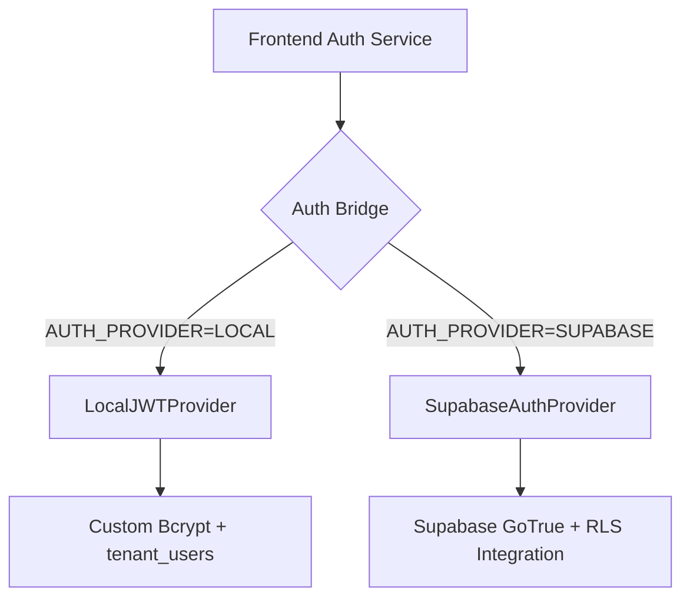

# Transmuter Platform Architecture

> **Owner**: Vastu (Chief Architect)
> **Last Updated**: 2026-04-25
> **Status**: Living Document — updated as architecture evolves

> **Design specification**: The original v3.0 design spec lives at [`docs/Architecture_and_Design_Agentic.md`](../Architecture_and_Design_Agentic.md). This file is the authoritative working document reflecting current implementation state.

---

## Table of Contents

1. [System Overview](#1-system-overview)
2. [Tech Stack Summary](#2-tech-stack-summary)
3. [Backend Architecture](#3-backend-architecture)
4. [Frontend Architecture](#4-frontend-architecture)
5. [Agent Architecture](#5-agent-architecture)
6. [Data Architecture](#6-data-architecture)
7. [Integration Points](#7-integration-points)
8. [Security Architecture](#8-security-architecture)
9. [Current Technical Debt & Improvement Opportunities](#9-current-technical-debt--improvement-opportunities)
10. [Architecture Decision Records](#10-architecture-decision-records)

---

## 1. System Overview

Aethos is an AI-agent-native SaaS ERP for small and medium enterprises. Every financial workflow is designed to be executed by PydanticAI agents with configurable human-in-the-loop checkpoints. GAAP-compliant double-entry accounting is enforced at the database layer.

### High-Level System Diagram

```
                         ┌─────────────────────────────────────────┐
                         │            Angular 18 SPA               │
                         │  (Tailwind + CSS Variables, NgRx Signals)│
                         │                                         │
                         │  ┌──────────┐ ┌──────────┐ ┌────────┐  │
                         │  │ Features │ │ AI/Agent │ │  Admin │  │
                         │  │ (AR/AP/  │ │ (Copilot,│ │ (RBAC, │  │
                         │  │ Banking, │ │  HITL,   │ │ Agent  │  │
                         │  │ GL, etc) │ │  Review) │ │ Config)│  │
                         │  └──────────┘ └──────────┘ └────────┘  │
                         └──────────────────┬──────────────────────┘
                                            │ HTTP / REST
                                            ▼
┌───────────────────────────────────────────────────────────────────────────────┐
│                         FastAPI Backend (Python 3.11+)                        │
│                                                                               │
│  ┌─────────────┐  ┌──────────────┐  ┌──────────────┐  ┌──────────────────┐  │
│  │ API Routers │→ │  Services    │→ │ Repositories │→ │  Supabase DB     │  │
│  │ (thin, no   │  │ (biz logic,  │  │ (typed CRUD) │  │  (PostgreSQL 15) │  │
│  │  biz logic) │  │  validation) │  │              │  │                  │  │
│  └─────────────┘  └──────┬───────┘  └──────────────┘  └──────────────────┘  │
│                          │                                      ▲            │
│                          ▼                                      │            │
│  ┌──────────────────────────────────────┐    ┌─────────────────┤            │
│  │        PydanticAI Agent Layer        │    │  DB Triggers     │            │
│  │                                      │    │  (auto-journal,  │            │
│  │  ┌─────────┐ ┌─────────┐ ┌────────┐ │    │   balance check, │            │
│  │  │ 24 AI   │ │ Pydantic│ │ Agent  │ │    │   immutability)  │            │
│  │  │ Agents  │ │ Graph   │ │Registry│ │    └──────────────────┘            │
│  │  │ (L0-L3) │ │ FSM     │ │        │ │                                    │
│  │  └─────────┘ └─────────┘ └────────┘ │                                    │
│  └──────────────────────────────────────┘                                    │
│                          │                                                   │
│  ┌───────────┐  ┌────────┴──────┐  ┌──────────────┐                        │
│  │ Event Bus │  │  Background   │  │  Audit Logger │                        │
│  │ (in-proc  │  │  Worker       │  │  (agent_audit │                        │
│  │  pub/sub) │  │  (Procrastin.)│  │   _log table) │                        │
│  └───────────┘  └───────────────┘  └──────────────┘                        │
└───────────────────────────────────────────────────────────────────────────────┘
                                            │
                              ┌─────────────┼─────────────┐
                              ▼             ▼             ▼
                        ┌──────────┐ ┌──────────┐ ┌──────────┐
                        │OpenRouter│ │ SendGrid │ │  Logfire  │
                        │ (LLM    │ │ (Email)  │ │(Telemetry)│
                        │  Gateway)│ │          │ │          │
                        └──────────┘ └──────────┘ └──────────┘
```

### Core Design Principles

1. **Tenant isolation is non-negotiable** — Every query, every agent call is tenant-scoped via RLS
2. **Agents never block core ERP** — Graceful degradation if AI is unavailable
3. **Money is sacred** — `Decimal` in Python, `NUMERIC(15,2)` in DB, strings in JSON
4. **Immutable posted transactions** — Corrections only via reversing entries
5. **Service layer owns business logic** — Routers are thin, repositories are data-only
6. **Structured outputs only** — Agents return typed Pydantic models, never raw text for business data

---

## 2. Tech Stack Summary

| Layer | Technology | Version | Purpose |
|-------|-----------|---------|---------|
| **Frontend** | Angular | 19 | SPA framework |
| | Angular Material | 19 | UI component library |
| | Tailwind CSS | 3 | Utility-first styling |
| | NgRx Signals | latest | State management |
| **Backend** | Python | 3.12+ | Runtime |
| | FastAPI | 0.115+ | HTTP framework |
| | Pydantic | v2 | Data validation / serialization |
| | PydanticAI | latest | AI agent framework |
| | Pydantic Graph | latest | FSM workflow engine |
| **Database** | Supabase | hosted | PostgreSQL 15+ with RLS |
| | supabase-py | latest | Python client |
| **AI/LLM** | OpenRouter | API | LLM gateway (Gemini Flash, Mistral) |
| | Pydantic Logfire | latest | Agent observability |
| **Task Queue** | Procrastinate | DB-backed | Background job processing |
| **Email** | SMTP / SendGrid | - | Transactional email |
| **Auth** | python-jose (JWT) | latest | Token-based authentication |
| **Rate Limiting** | SlowAPI | latest | Per-endpoint rate limiting |
| **Containerization** | Docker Compose | - | Local dev / deployment |

---

## 3. Backend Architecture

### 3.1 Layer Diagram

```
┌─────────────────────────────────────────────────────────┐
│                    API Layer (Routers)                   │
│  app/api/*.py — 30 router modules                       │
│  Thin: validation, auth, delegation to service          │
│  Dependencies: get_current_user, require_permission     │
├─────────────────────────────────────────────────────────┤
│                    Service Layer                         │
│  app/services/*.py — 20 service classes                 │
│  Business logic, domain rule enforcement                │
│  All extend BaseService (tenant-scoped queries)         │
├─────────────────────────────────────────────────────────┤
│                    Repository Layer                      │
│  app/repositories/*.py — 6 repository classes           │
│  Typed CRUD wrappers over BaseService                   │
│  No business logic, single-table focus                  │
├─────────────────────────────────────────────────────────┤
│                    Domain Layer                          │
│  app/domain/*.py — Pure functions, no DB calls          │
│  enums.py, rules.py, money.py, events.py,              │
│  journal_patterns.py                                    │
├─────────────────────────────────────────────────────────┤
│                    Agent Layer                           │
│  app/agents/*.py — 24 PydanticAI agents                │
│  app/agents/graphs/*.py — 5 Pydantic Graph FSMs        │
├─────────────────────────────────────────────────────────┤
│                    Infrastructure Layer                  │
│  app/core/*.py — Config, auth, DB, logging, sanitize   │
│  app/events/*.py — Event bus + 4 handler modules       │
│  app/workers/*.py — Background task processing         │
└─────────────────────────────────────────────────────────┘
```

### 3.2 Request Lifecycle

```
HTTP Request
  → FastAPI Middleware (CORS, Security Headers, Response Time)
  → Rate Limiter (SlowAPI, per-endpoint)
  → Router (path matching, request parsing)
  → Auth Dependency (get_current_user → JWT decode → DB user lookup → RBAC check)
  → Service (business logic, domain rule validation, period lock check)
  → Repository / Supabase Client (tenant-scoped query)
  → DB Triggers (auto-journal, balance validation, immutability)
  → Event Bus (publish domain events → handlers fire asynchronously)
  → Response (Pydantic model serialization, Decimal → string)
```

### 3.3 BaseService Pattern

All services inherit from `BaseService` (`app/services/base_service.py`) which provides:

- **Tenant scoping**: Every query automatically filters by `tenant_id` and excludes soft-deleted rows
- **CRUD helpers**: `_query()`, `_insert()`, `_update()`, `_soft_delete()`, `_find_by_id()`, `_require_by_id()`
- **DB error translation**: PostgreSQL error codes (23503, 23505, 23502, 23514) mapped to HTTP 400/409/500
- **Pagination**: `apply_pagination(query, limit, offset)`
- **Soft deletes**: Sets `deleted_at` timestamp, never hard deletes

**Key constraint**: Services use the anon key Supabase client (RLS enforced). Agents use the service role client for cross-tenant operations like audit logging.

### 3.4 Router Conventions

Located in `app/api/`. Every router follows this pattern:

```python
@router.post("/")
async def create_resource(
    payload: ResourceCreate,
    tenant_id: str = Depends(get_tenant_from_header),
    _auth: CurrentUser = Depends(require_permission("resource:create")),
):
    service = ResourceService(tenant_id)
    return await service.create(payload)
```

Routers across 10 phases, each adding functional modules:
- Phase 1: Core (dashboard, accounts, contacts, invoices, payments, expenses, banking, journals, reports, agents)
- Phase 2: Extended (quotes, credit notes, items, tax rates, tracking, POs, fixed assets, settings, AI copilot)
- Phase 3: Enhanced AP (ap_master, workflows)
- Phase 4: AR & Collections (collections, recurring_invoices)
- Phase 5: Budgeting
- Phase 6: Enhanced GL & Reporting
- Phase 7: Assets & Leasing
- Phase 8: Cost Accounting
- Phase 9: AI/ML Insights
- Phase 10: Agent Direct Endpoints

### 3.5 Domain Rules Engine

Pure validation functions in `app/domain/rules.py` (no DB calls):

| Rule | Function | Description |
|------|----------|-------------|
| VR-01 | `check_positive_amount()` | Amount > 0 |
| VR-02 | `validate_date_not_future()` | Date within max_days_future |
| VR-05 | `validate_payment_amount()` | Payment <= amount_due |
| VR-06 | `validate_credit_note_amount()` | Credit note <= original total |
| VR-07 | `validate_invoice_voidable()` | Cannot void PAID invoices |
| VR-10 | `check_min_line_items()` | Minimum 1 line item |
| VR-11 | `check_no_negative_line_items()` | No negative amounts |
| DE-01 | `validate_journal_balance()` | Debits = Credits (+-0.01 tolerance) |

### 3.6 Money Value Object

`app/domain/money.py` enforces the critical rule that all monetary values use `Decimal`:

- `to_money(value)` → `Decimal` rounded to 2dp (`ROUND_HALF_UP`)
- `to_quantity(value)` → `Decimal` rounded to 4dp
- `Money` dataclass: immutable, currency-safe arithmetic, comparison operators
- `AethosModel` base class configures `json_encoders={Decimal: str}` for API serialization

### 3.7 Event System

**In-process async event bus** (`app/events/bus.py`):

- Module-level singleton `event_bus`
- `publish(event)` dispatches to all registered handlers
- Exceptions in handlers are caught, logged, and isolated — no cascading failures
- Handlers are auto-registered at import time

**Domain Events** (`app/domain/events.py`):

| Event | Triggers |
|-------|----------|
| `InvoiceCreated` | Contact intelligence |
| `InvoiceSent` | Notification handler |
| `InvoiceVoided` | Reversal journal handler |
| `PaymentReceived` | Payment matching agent |
| `BillApproved` | Duplicate detector agent |
| `JournalPosted` | Anomaly detection (if amount > $500) |
| `PaymentMade` | Anomaly detection (if amount > $1000) |
| `AgentReviewRequested` | High-priority HITL notification |
| `PeriodLocked` | Audit log entry |

**4 Handler Modules**:
1. `journal_handler.py` — Reversal journals for voided invoices, audit log for period locks
2. `notification_handler.py` — Notification records for invoice sends and HITL reviews
3. `agent_trigger_handler.py` — Triggers payment matching and duplicate detection agents
4. `anomaly_event_handler.py` — Proactive anomaly scans for large transactions

### 3.8 Background Workers

**Architecture**: DB-backed task queue using `procrastinate_jobs` table in Supabase.

```
┌─────────────┐     ┌─────────────────────┐     ┌──────────────────┐
│ API enqueues │ ──→ │ procrastinate_jobs   │ ──→ │ Worker (polling  │
│ via TaskQueue│     │ table (status=todo)  │     │ every 5 seconds) │
└─────────────┘     └─────────────────────┘     └────────┬─────────┘
                                                          │
                                                          ▼
                                                  ┌──────────────┐
                                                  │ AgentLoader  │
                                                  │ (dynamic     │
                                                  │ import + run)│
                                                  └──────────────┘
```

- Worker starts as a daemon thread in the FastAPI lifespan handler
- `AgentLoader` dynamically imports agent modules with caching
- Tasks are marked `doing` → `succeeded`/`failed` with results stored in `extra` column
- Scheduled tasks: depreciation, collections reminders, exchange rate updates, cashflow forecasts, recurring invoices

### 3.9 GL Auto-Journal Triggers

Critical accounting automation lives at the **database layer**, not in Python:

| Trigger | Table | Event | GL Effect |
|---------|-------|-------|-----------|
| `trg_invoice_sent` | invoices | UPDATE (status→sent) | DR Accounts Receivable / CR Revenue |
| `trg_payment_received` | payments | INSERT | DR Bank / CR Accounts Receivable |
| `trg_expense_approved` | expenses | UPDATE (ai_status→Verified) | DR Expense / CR Accounts Payable |
| `check_balance_before_post` | journal_entries | UPDATE | Validate debits = credits |
| `no_update_posted` | journal_entries | UPDATE | Prevent modifications to posted journals |
| `trg_prevent_agent_audit_delete` | agent_audit_log | DELETE | Prevent audit log deletion |

**JournalService** is the ONLY Python code that writes to `journal_entries` / `journal_lines` (for manual journals and reversals). All automatic journals are handled by PostgreSQL triggers.

---

## 4. Frontend Architecture

### 4.1 Application Structure

```
frontend/src/app/
├── app.component.ts        ← Root shell (sidebar, topbar, router-outlet)
├── app.config.ts           ← Provider configuration (router, HTTP, interceptors)
├── app.routes.ts           ← ~50 lazy-loaded routes with authGuard
├── core/
│   ├── interceptors/
│   │   ├── auth.interceptor.ts     ← Injects X-Tenant-Id + X-User-Id headers
│   │   ├── loading.interceptor.ts  ← Global loading spinner
│   │   └── http-error.interceptor.ts ← Error toast notifications
│   ├── services/
│   │   ├── base-api.service.ts     ← HTTP wrapper with tenant headers
│   │   ├── auth.service.ts         ← Login/logout via JWT
│   │   ├── invoice-api.service.ts  ← Invoice-specific API calls
│   │   └── ... (8 more API services)
│   ├── store/
│   │   └── auth.store.ts           ← NgRx Signal Store (root-level)
│   ├── sidebar.component.ts        ← Collapsible navigation
│   ├── topbar.component.ts         ← Header bar
│   ├── toast.component.ts          ← Toast notification system
│   └── auth.guard.ts               ← Route guard (checks AuthStore)
├── features/
│   ├── dashboard.component.ts      ← Main dashboard
│   ├── invoices/                   ← AR invoices (list, create)
│   ├── bills/                      ← AP bills (upload, review, create)
│   ├── banking/                    ← Bank rec, cash coding, review
│   ├── budgets/                    ← Budget plans, vs actual, CAPEX
│   ├── admin/                      ← 18 admin components
│   ├── ai/                         ← AI copilot chat interface
│   └── ... (14 more feature dirs)
└── shared/
    └── components/
        └── loading-indicator/      ← Reusable spinner
```

### 4.2 Key Patterns

**Standalone Components**: All Angular 18 components use the standalone pattern — no NgModules. Each route lazily loads its component:

```typescript
{ path: 'invoices', loadComponent: () =>
    import('./features/invoices/invoice-list.component').then(m => m.InvoiceListComponent) }
```

**State Management**: NgRx Signal Store at root level for auth state. Features manage their own local state via component signals or service-level BehaviorSubjects.

```typescript
export const AuthStore = signalStore(
  { providedIn: 'root' },
  withState(initialState),
  withMethods(...),
  withHooks({ onInit: ... })  // Hydrate from localStorage
);
```

**HTTP Interceptor Chain**:
1. `authInterceptor` — Injects `X-Tenant-Id` and `X-User-Id` headers from AuthStore
2. `loadingInterceptor` — Manages global loading spinner state
3. `httpErrorInterceptor` — Catches HTTP errors and shows toast notifications

**BaseApiService**: Service base class providing typed HTTP methods (`get<T>`, `post<T>`, `put<T>`, `delete<T>`) with automatic tenant header injection.

### 4.3 Theme System

- Dark theme: `slate-900` background, `slate-800` cards, `slate-700` borders
- Accent colors: amber/orange for agent indicators, indigo for primary actions
- CSS custom properties (`var(--t-bg)`) for theme switching via `ThemeService`
- Tailwind utilities for layout, Angular Material for complex widgets

### 4.4 Agent UI Components

| Component | Purpose |
|-----------|---------|
| `ai-copilot.component.ts` | Slide-out chat panel with streaming responses |
| `agent-dashboard.component.ts` | Supervisor view: metrics, autonomy controls, audit log |
| `agent-hitl-review.component.ts` | HITL review queue per agent |
| `agent-activity-log.component.ts` | Chronological agent action feed |
| `agent-corrections.component.ts` | Correction tracking for retraining |
| `bill-upload.component.ts` | Split-screen AI review (document + extracted data) |
| `reconciliation-review.component.ts` | Bank reconciliation review with match confidence |

### 4.5 Routing Architecture

~50 routes organized into protected (behind `authGuard`) and public paths:

- **Public**: `/`, `/login`, `/signup`, `/about`
- **Protected**: All business routes under `canActivate: [authGuard]`
- **Route groups**: Sales, Purchases, Banking, AI & Admin, RBAC Admin, AP Admin, AR & Collections, Budgeting, GL Configuration, Assets & Leasing, Cost Accounting, AI Insights, Agent Supervisor, Settings, Master Data

---

## 5. Agent Architecture

### 5.1 Agent Framework

All agents are built on **PydanticAI** with **OpenRouter** as the LLM gateway.

```
┌────────────────────────────────────────────────────┐
│                  Agent Registry                     │
│  24 registered agents, each with:                  │
│  - agent_id, name, description                     │
│  - default autonomy_level (L0-L3)                  │
│  - domain (gl, ap, ar, banking, intelligence, etc) │
│  - model (resolved from env via AgentModels)       │
│  - hitl_classification                             │
└────────────────────────┬───────────────────────────┘
                         │
          ┌──────────────┼──────────────┐
          ▼              ▼              ▼
    ┌──────────┐  ┌──────────┐  ┌──────────────┐
    │ Standard │  │ Graph    │  │ Pure Python  │
    │ Agents   │  │ Workflows│  │ Validators   │
    │ (PydanticAI)│ (Pydantic │  │ (no LLM)    │
    │          │  │  Graph)  │  │              │
    └──────────┘  └──────────┘  └──────────────┘
```

### 5.2 Model Factory

`app/agents/model_factory.py` provides a centralized factory:

```python
make_model(agent_id: str) -> OpenAIModel
```

- Resolves model name from environment variables via `Settings.agent_models`
- Creates `OpenAIModel` with `OpenRouterProvider`
- LRU-cached (max 32 entries) — each agent_id creates only one client instance
- Supports API key rotation via `settings.get_openrouter_api_key()` (random choice from pool)

### 5.3 Agent Dependencies

`AgentDeps` (`app/agents/base.py`) is the dependency injection container for all agents:

```python
@dataclass
class AgentDeps:
    tenant_id: str           # Tenant scope
    db: Client               # Supabase service client
    user_id: str             # Acting user
    autonomy_level: int      # L0-L3, loaded from agent_configurations table
    agent_id: str            # Self-identification for audit
```

- Factory method `AgentDeps.for_agent(tenant_id, agent_id)` loads autonomy level from DB
- Uses service role client (bypasses RLS for cross-table access)
- Graceful degradation: defaults to L1 if DB config unavailable

### 5.4 Autonomy Levels

| Level | Name | Behavior |
|-------|------|----------|
| L0 | Disabled | Agent does not run |
| L1 | Suggest | Agent produces recommendations; human decides |
| L2 | Act + Notify | Agent acts autonomously, notifies human of actions |
| L3 | Full Auto | Agent acts without notification (except audit log) |

- Configured per-tenant, per-agent in `agent_configurations` table
- `accounting_guardian` is **hardcoded L3** — cannot be disabled
- Autonomy level is checked at runtime via `AgentDeps.for_agent()`

### 5.5 Agent Catalog (24 Agents)

| Domain | Agent | Default Level | HITL | Description |
|--------|-------|:---:|------|-------------|
| **GL** | accounting_guardian | L3 | always | Validates all financial writes (cannot be disabled) |
| **GL** | period_close_agent | L2 | conditional | Month-end checklist automation |
| **GL** | depreciation_agent | L3 | always | Monthly batch depreciation + GL journals |
| **GL** | reporting_agent | L2 | none | Proactive financial insights |
| **GL** | revenue_recognition_agent | - | - | Revenue recognition rules |
| **AP** | ap_invoice_agent | L2 | conditional | OCR + LLM invoice data extraction |
| **AP** | gl_classifier_agent | L2 | conditional | Expense→GL account classification |
| **AP** | duplicate_detector | L3 | none | Duplicate invoice detection |
| **AR** | ar_invoice_agent | L1 | always | Auto-fill invoice line items |
| **AR** | payment_matching_agent | L2 | conditional | Bank deposit→AR invoice matching |
| **AR** | collections_agent | L3 | conditional | Overdue invoice reminders + escalation |
| **Banking** | reconciliation_agent | L2 | conditional | Bank statement→GL matching |
| **Banking** | cash_coding_agent | L2 | conditional | Unmatched transaction categorization |
| **Intelligence** | anomaly_detection_agent | L3 | none | Real-time fraud/anomaly detection |
| **Intelligence** | cashflow_forecast_agent | L2 | optional | 30/60/90 day cash projection |
| **Intelligence** | budget_variance_agent | L2 | none | Budget vs actual monitoring |
| **Intelligence** | budget_generator_agent | L1 | always | Historical-based budget proposals |
| **Intelligence** | workforce_planning_agent | L1 | always | Payroll impact forecasting |
| **Core** | copilot_agent | L2 | optional | Natural language ERP gateway |
| **Core** | onboarding_agent | L2 | always | Conversational org setup |
| **Core** | fx_management_agent | L2 | conditional | Exchange rate management + FX revaluation |
| **Core** | recurring_txn_agent | L3 | conditional | Recurring invoice/journal generation |
| **Contacts** | contact_intelligence | L2 | conditional | Contact enrichment + dedup |
| **Tax** | tax_compliance_agent | L2 | always | BAS/GST/VAT return preparation |
| **Workflows** | smart_approval_agent | L2 | conditional | Intelligent approval routing |
| **Procurement** | procurement_agent | - | - | Procurement workflow support |

### 5.6 Model Allocation

Agents use two model tiers via OpenRouter:

- **Tier 1 (Complex/Vision)**: `google/gemini-2.0-flash-001` — Used by 20+ agents for structured reasoning, classification, and vision (invoice OCR)
- **Tier 2 (Conversational)**: `mistralai/mistral-small-3.1-24b-instruct` — Used by `collections_agent` (email writing) and `onboarding_agent` (conversational setup)

All models are configurable per-agent via environment variables (e.g., `AGENT_MODEL_COPILOT`).

### 5.7 Pydantic Graph Workflows

Multi-step agent workflows use **Pydantic Graph** (FSM-based):

| Graph | Nodes | Purpose |
|-------|-------|---------|
| `invoice_processing` | Extract → ValidateVendor → DuplicateCheck → Classification | AP invoice intake pipeline |
| `bank_reconciliation` | LoadTransactions → MatchTransactions → Coding → Finalize | Bank rec with confidence scoring |
| `copilot_graph` | Router → (domain-specific nodes) | Multi-agent query routing |
| `approval_workflow` | - | Configurable approval chains |
| `period_end_close` | - | Month-end close checklist |

Each node in a graph receives `GraphRunContext[State, AgentDeps]` with access to shared state and tenant-scoped DB.

### 5.8 Agent Audit System

Every agent action is logged to the append-only `agent_audit_log` table via `AgentAuditLogger`:

```
agent_audit_log
├── tenant_id, agent_id, action
├── input_summary (JSONB)
├── output_summary (JSONB)
├── prompt (text)
├── agent_thoughts (JSONB) — extracted from PydanticAI message parts
├── tool_calls (JSONB) — tool name + args
├── confidence (float)
├── model_used (string)
├── latency_ms (int)
├── requires_review (bool)
├── human_action (nullable) — set when human reviews
└── created_at
```

- **Append-only**: PostgreSQL trigger `trg_prevent_agent_audit_delete` prevents deletion
- **Logfire integration**: Warnings emitted for latency > 2000ms or confidence < 0.70
- **Agent corrections**: Stored in `agent_corrections` table for weekly retraining pipeline

### 5.9 Graceful Degradation

`run_agent_safe()` (`app/agents/base.py`) wraps all agent calls:

```python
async def run_agent_safe(agent_fn, *args, fallback=None, **kwargs):
    try:
        return await agent_fn(*args, **kwargs)
    except Exception:
        logger.warning("Agent call failed (graceful degradation)")
        return fallback
```

If an agent fails (LLM timeout, API error, model unavailable), the core ERP operation continues with the fallback value. The ERP is never blocked by AI unavailability.

---

## 6. Data Architecture

### 6.1 Database Overview

- **Platform**: Supabase (hosted PostgreSQL 15)
- **Tables**: 83 tables, 2 views, 7 sequences, 8 functions, 14 triggers
- **Client access**: Two Supabase client singletons
  - `get_db()` — anon key client (RLS enforced)
  - `get_service_db()` — service role client (bypasses RLS, used by agents and audit logging)

### 6.2 Schema Groups

```
┌─────────────────────────────────────────────────────┐
│  Core Accounting (12 tables)                        │
│  accounts, invoices, invoice_lines, payments,       │
│  payment_allocations, settlements, expenses,        │
│  journal_entries, journal_lines, credit_notes,      │
│  credit_note_lines, credit_note_allocations         │
├─────────────────────────────────────────────────────┤
│  Banking (3 tables)                                 │
│  bank_accounts, bank_transactions, bank_coding_rules│
├─────────────────────────────────────────────────────┤
│  Contacts & Items (5 tables)                        │
│  contacts, customer_groups, vendor_groups,           │
│  contact_group_members, items                       │
├─────────────────────────────────────────────────────┤
│  Documents (4 tables)                               │
│  quotes, quote_lines, purchase_orders,              │
│  purchase_order_lines                               │
├─────────────────────────────────────────────────────┤
│  Fixed Assets (5 tables)                            │
│  fixed_assets, depreciation_schedules,              │
│  depreciation_books, asset_groups,                  │
│  asset_transactions                                 │
├─────────────────────────────────────────────────────┤
│  Budgets (5 tables)                                 │
│  budget_plans, budget_lines, budget_plan_lines,     │
│  budget_register_entries, budget_control_rules       │
├─────────────────────────────────────────────────────┤
│  Agent Infrastructure (5 tables)                    │
│  agent_configurations, agent_audit_log,             │
│  agent_corrections, agent_metrics,                  │
│  bank_coding_rules                                  │
├─────────────────────────────────────────────────────┤
│  RBAC (4 tables)                                    │
│  roles, permissions, role_permissions, user_roles    │
├─────────────────────────────────────────────────────┤
│  Tenancy & Users (3 tables)                         │
│  tenants, tenant_users, users                       │
├─────────────────────────────────────────────────────┤
│  Workflows & Approvals (4 tables)                   │
│  approval_workflows, approval_workflow_steps,       │
│  approval_requests, approval_actions                │
├─────────────────────────────────────────────────────┤
│  Configuration & Settings (12+ tables)              │
│  fiscal_periods, locked_periods, tax_rates,         │
│  payment_terms, payment_methods, tracking_*,        │
│  organisation_settings, posting_profiles,           │
│  recurring_invoices, recurring_journals, etc.       │
└─────────────────────────────────────────────────────┘
```

### 6.3 Tenant Isolation

Every table has a `tenant_id` column. Isolation is enforced at multiple levels:

1. **RLS Policies**: PostgreSQL RLS using `(current_setting('app.tenant_id', true))::uuid`
2. **Service Layer**: `BaseService._query()` always appends `.eq("tenant_id", self.tenant_id)`
3. **Agent Layer**: `AgentDeps.tenant_id` scopes all agent DB queries
4. **Auth Layer**: JWT token contains `tenant_id`; validated against user's tenant membership

**Service role client** (`get_service_db()`) bypasses RLS for:
- Agent audit logging (needs to write regardless of RLS context)
- Cross-tenant background worker operations
- Tenant context is set via RPC: `db.rpc("set_tenant_context", {"tenant_uuid": tenant_id})`

### 6.4 Soft Deletes

All entities use soft deletes via `deleted_at` timestamp column. `BaseService._query()` automatically excludes soft-deleted rows with `.is_("deleted_at", "null")`. `_query_all()` is available for admin/audit access.

### 6.5 Sequences

Document numbers are generated via PostgreSQL sequences (never in application code):

| Sequence | Usage |
|----------|-------|
| `invoice_number_seq` | INV-000001 |
| `bill_number_seq` | BILL-000001 |
| `journal_entry_number_seq` | JE-000001 |
| `payment_number_seq` | PAY-000001 |
| `credit_note_number_seq` | CN-000001 |
| `po_number_seq` | PO-000001 |
| `quote_number_seq` | QUO-000001 |

Services call via RPC (`next_sequence_value`) with fallback to count-based generation.

### 6.6 Key Indexes

```sql
idx_payment_alloc_unallocated    -- Fast unallocated payment lookup
idx_corrections_training         -- Agent correction retrieval for retraining
idx_bank_coding_rules_pattern    -- Active coding rule pattern matching
idx_journal_reversals            -- Reversal journal lookup
idx_agent_audit_log_tenant_created -- Agent audit log time-series queries
idx_contacts_search              -- Contact search with soft delete filter
```

---

## 7. Integration Points

### 7.1 OpenRouter (LLM Gateway)

```
┌──────────┐     ┌──────────────┐     ┌──────────────┐
│ PydanticAI│ ──→ │ OpenRouter   │ ──→ │ Google Gemini│
│ Agent     │     │ API Gateway  │     │ Mistral      │
│           │     │              │     │ (+ others)   │
└──────────┘     └──────────────┘     └──────────────┘
```

- All LLM calls route through OpenRouter (`https://openrouter.ai/api/v1`)
- API key pool with random rotation for load balancing
- Per-agent model selection via environment variables
- `OpenAIModel` with `OpenRouterProvider` from PydanticAI

### 7.2 Pydantic Logfire (Observability)

- Optional (graceful if `LOGFIRE_TOKEN` not set)
- Instruments FastAPI (request tracing) and PydanticAI (agent tracing)
- Agent audit logger emits `logfire.warn` for high-latency or low-confidence agent actions
- Service name: `aethos-api`

### 7.3 Supabase Platform

| Feature | Usage |
|---------|-------|
| PostgreSQL | Primary database (83 tables, RLS, triggers, functions) |
| Supabase Auth | User authentication (auth.users) |
| Supabase Storage | Invoice file uploads (`invoices` bucket) |
| Supabase Realtime | Agent activity notifications (WebSocket subscriptions) |

### 7.4 Email (SMTP / SendGrid)

- Invoice email delivery via background tasks
- SMTP configuration via environment variables (`SMTP_HOST`, `SMTP_USER`, `SMTP_PASS`)
- PDF generation using ReportLab
- Collections agent generates escalating reminder emails

### 7.5 Background Task Queue (Procrastinate)

- Migrated from Redis/ARQ to PostgreSQL-backed Procrastinate
- Uses `procrastinate_jobs` table in Supabase
- Docker Compose runs a separate `worker` container
- In development: worker runs as a daemon thread in the FastAPI process

---

## 8. Security Architecture

### 8.1 Authentication Bridge
Aethos supports a configurable authentication layer that can be toggled between **Local JWT** and **Supabase Auth** via the `AUTH_PROVIDER` environment variable.



#### Local JWT Provider
- **Mechanism**: Custom HS256 tokens generated by the backend.
- **Data Store**: `tenant_users` table holds `password_hash`.
- **Pros**: Zero external dependency, total control.
- **Cons**: Requires `SERVICE_ROLE_KEY` to bypass RLS for initial login/registration.

#### Supabase Auth Provider (GoTrue)
- **Mechanism**: Standard JWTs issued by Supabase GoTrue.
- **Integration**: Natively recognized by PostgreSQL RLS (`auth.uid()`).
- **User Metadata**: Tenants and Roles mapped via Supabase User Metadata or `public.tenant_users` synchronization.
- **Pros**: Native RLS support, MFA, Social Logins.

### 8.2 Authentication Flow (Legacy/Local)

```
┌─────────┐     ┌──────────┐     ┌───────────┐     ┌──────────┐
│ Angular  │ ──→ │ POST     │ ──→ │ Verify    │ ──→ │ Return   │
│ Login    │     │ /auth/   │     │ credentials│     │ JWT      │
│ Form     │     │ login    │     │ via Supabase│     │ token    │
└─────────┘     └──────────┘     └───────────┘     └──────────┘
                                                         │
                    ┌────────────────────────────────────┘
                    ▼
              ┌──────────┐
              │ JWT in   │ ──→ Every API request carries:
              │ localStorage│    - Authorization: Bearer <token>
              │ + AuthStore │    - X-Tenant-Id (via interceptor)
              └──────────┘
```

- JWT tokens: HS256, 24-hour expiry
- `JWT_SECRET` required in production (fails loudly if missing)
- Legacy header-based auth (`X-Tenant-Id` + `X-User-Id`) for backward compatibility (dev only)
- `CurrentUser` object populated from DB on every request

### 8.2 Authorization (RBAC)

4-table RBAC model: `roles`, `permissions`, `role_permissions`, `user_roles`

```python
# Permission check dependency
@router.post("/")
async def create(
    _auth: CurrentUser = Depends(require_permission("invoices:create")),
):
```

- `require_permission(code)` — single permission check
- `require_any_permission(*codes)` — any-of check
- Owner and admin roles have implicit full permissions
- `is_super_admin` flag bypasses all permission checks
- Permissions follow `module:action` convention (e.g., `invoices:create`, `bills:read`)

### 8.3 PII Masking

`app/agents/base.py` contains `mask_pii()` function applied before sending data to external LLMs:

| Pattern | Replacement |
|---------|-------------|
| Card numbers (16 digits) | `[CARD-REDACTED]` |
| Bank account numbers (6-12 digits near "bank"/"account") | `[ACCT-REDACTED]` |
| Australian ABN (XX XXX XXX XXX) | `[TAX-REDACTED]` |
| IBAN (international format) | `[IBAN-REDACTED]` |

### 8.4 Input Sanitization

`app/core/sanitization.py` provides:

- `sanitize_for_like()` — Escapes `%`, `_`, `\` for LIKE/ILIKE queries, limits length
- `sanitize_for_search()` — Removes dangerous characters for full-text search
- `escape_sql_identifier()` — Validates SQL identifiers against injection
- `mask_sensitive_data()` — Masks all but last N characters for logging

### 8.5 Security Middleware

- **SecurityHeadersMiddleware**: Sets `X-Content-Type-Options`, `X-Frame-Options`, `X-XSS-Protection`, `Strict-Transport-Security`, `Referrer-Policy`
- **CORS**: Restricted to known origins (configurable via `CORS_ORIGINS`)
- **Rate Limiting**: SlowAPI with `get_remote_address` key function
- **File Upload Validation**: MIME type whitelist + 20MB size limit

### 8.6 Database Security

- **RLS**: Row-Level Security on most tables via tenant_id
- **Immutable posted journals**: DB trigger `no_update_posted` prevents modifications
- **Append-only audit log**: DB trigger `trg_prevent_agent_audit_delete` prevents deletions
- **Soft deletes**: Data is never physically deleted from the application layer

---

## 9. Current Technical Debt & Improvement Opportunities

### 9.1 Critical / High Priority

| ID | Issue | Impact | Location |
|----|-------|--------|----------|
| **TD-01** | **BaseRepository extends BaseService** — Repository inherits from Service, blurring layer boundaries. Repositories should not depend on `get_db()` directly via BaseService. | Architecture | `app/repositories/base_repository.py` |
| **TD-02** | **Auth interceptor sends tenant headers instead of JWT** — The Angular auth interceptor injects `X-Tenant-Id` and `X-User-Id` headers instead of the JWT Bearer token. The backend supports JWT but the frontend doesn't use it consistently. | Security | `frontend/src/app/core/interceptors/auth.interceptor.ts` |
| **TD-03** | **Duplicate agent module maps** — Agent-to-module mapping exists in three places: `worker.py` `AgentLoader._AGENT_MAP`, `agent_runner.py` `AGENT_MODULE_MAP`, and `registry.py`. These can drift out of sync. | Maintainability | Multiple files |
| **TD-04** | **RLS not enabled on all tables** — The DATABASE_SCHEMA.md notes that several tables (accounts, audit_log, bank_accounts, bank_transactions, budget_plans, etc.) do not have RLS enabled. | Security | Supabase DB |
| **TD-05** | **`datetime.utcnow()` deprecated** — Used in multiple handlers and services. Should use `datetime.now(timezone.utc)` (Python 3.12 deprecation). | Code Quality | Event handlers, services |

### 9.2 Medium Priority

| ID | Issue | Impact | Location |
|----|-------|--------|----------|
| **TD-06** | **No request-scoped DB sessions** — All services create a new `get_db()` call. No transaction boundaries for multi-table operations (e.g., invoice + lines). Supabase HTTP API doesn't support traditional transactions. | Data Integrity | `app/services/base_service.py` |
| **TD-07** | **`asyncio.run()` inside sync worker thread** — The background worker calls `asyncio.run()` inside `_run_agent_task()` which can conflict with the main event loop. | Reliability | `app/workers/worker.py:287` |
| **TD-08** | **Hardcoded confidence values** — Several places use mock confidence scores (0.85, 0.95) instead of extracting them from agent results. | Accuracy | `app/workers/worker.py:241`, `app/workers/tasks/agent_runner.py:114` |
| **TD-09** | **float() used in PDF generation and anomaly handler** — `float()` is used for monetary amounts in PDF generation and anomaly event threshold checks. Should use `Decimal`. | Accounting | `app/api/invoices.py:411-413`, `app/events/handlers/anomaly_event_handler.py:46-51` |
| **TD-10** | **Copilot agent wraps Graph in mock RunResult** — The `CopilotAgentGraphWrapper` creates an ad-hoc `GraphRunResult` class instead of using PydanticAI's proper result type. | Code Quality | `app/agents/copilot_agent.py` |
| **TD-11** | **CodingNode in bank_reconciliation uses hardcoded account** — The `CodingNode` assigns a default "6400" account code instead of wiring in the `cash_coding_agent`. | Feature Gap | `app/agents/graphs/bank_reconciliation.py:127-133` |
| **TD-12** | **No structured error responses** — API errors use raw strings in `detail` rather than structured error codes. Frontend cannot programmatically differentiate error types. | API Quality | All routers |

### 9.3 Low Priority / Nice-to-Have

| ID | Issue | Impact | Location |
|----|-------|--------|----------|
| **TD-13** | **No API versioning beyond prefix** — All routes use `/api/v1` but there's no mechanism for v2 coexistence. | Evolvability | `app/main.py` |
| **TD-14** | **BaseApiService duplicates AuthStore logic** — Both `BaseApiService` and the auth interceptor read from localStorage independently. | Duplication | `frontend/src/app/core/services/base-api.service.ts` |
| **TD-15** | **No OpenAPI schema generation for agent endpoints** — Agent response types aren't consistently documented in OpenAPI. | Developer Experience | `app/api/agent_endpoints.py` |
| **TD-16** | **Redis referenced in health check but migrated away** — Health check still checks `redis` key but Redis was removed in favor of Procrastinate. | Cleanup | `app/main.py:262` |

---

## 10. Architecture Decision Records

### ADR-001: Internal Service Communication Pattern
- **Context**: High-volume internal operations (like data seeding or periodic batch processing) can cause event-loop deadlocks in single-worker environments if they attempt recursive HTTP calls to the same server.
- **Decision**: Favor **Direct Service Layer Calls** over Internal REST calls. 
- **Implementation**: 
    - Inject `Service` classes directly into orchestrators. 
    - Internal use cases should bypass the FastAPI `Request`/`Response` stack and call business logic functions directly (e.g., `InvoiceService.create_invoice(payload, tenant_id)`).
- **Impact**: 
    - Zero network overhead.
    - Immune to uvicorn/httpx deadlocks.
    - Easier mocking in tests.

### ADR-002: UI Responsiveness via Background Tasks (ARQ/Procrastinate)
- **Context**: Complex ERP operations (Seeding, AI Anomaly Scans, Depreciation) can take >5s, blocking the UI.
- **Decision**: All operations expected to exceed 500ms MUST be offloaded to a background task.
- **Implementation**: 
    - API returns `202 Accepted` immediately with a `job_id`.
    - `Procrastinate` worker handles the heavy lifting.
    - Frontend listens via WebSocket or polls a `Status` endpoint.
- **Impact**: Consistent UI snappiness regardless of backend workload complexity.

### ADR-001: Supabase as Primary Database Platform

**Status**: Accepted
**Context**: Needed a managed PostgreSQL with built-in auth, storage, and real-time capabilities for a multi-tenant SaaS product.
**Decision**: Use Supabase (hosted PostgreSQL 15) as the primary data platform.
**Consequences**:
- (+) RLS for tenant isolation built into the platform
- (+) Storage buckets for invoice files
- (+) Realtime WebSocket for agent activity notifications
- (+) Auth integration for user management
- (-) HTTP-based client means no traditional DB transactions (Supabase REST API)
- (-) Connection pooling constraints (migrated from Redis to Procrastinate)

### ADR-002: GL Auto-Journals via DB Triggers (Not Python)

**Status**: Accepted
**Context**: Invoice sent, payment received, and expense approved events must generate GL journal entries. This could be done in Python service layer or DB triggers.
**Decision**: Implement GL auto-journals as PostgreSQL BEFORE triggers.
**Consequences**:
- (+) Guarantee that journal entries are always created, even if Python crashes mid-operation
- (+) Single source of truth for accounting logic
- (+) Cannot be bypassed by application bugs
- (-) Trigger logic is harder to unit test
- (-) Debugging requires DB-level tooling
- (-) Migration of trigger logic requires DB schema changes

### ADR-003: PydanticAI + OpenRouter for Agent Framework

**Status**: Accepted
**Context**: Needed an agent framework that supports structured outputs, tool calling, and multiple LLM providers.
**Decision**: Use PydanticAI for agent framework with OpenRouter as the LLM gateway.
**Consequences**:
- (+) Typed structured outputs via Pydantic models
- (+) Dependency injection via `RunContext[AgentDeps]`
- (+) Model-agnostic: can switch between Gemini, Mistral, Claude, etc. via config
- (+) OpenRouter provides single API for all providers
- (-) OpenRouter adds latency (extra hop)
- (-) PydanticAI is a newer framework with evolving APIs

### ADR-004: In-Process Event Bus (Not External Message Broker)

**Status**: Accepted (with caveats)
**Context**: Domain events need to trigger side effects (notifications, agent runs, audit logging).
**Decision**: Use an in-process async event bus (`app/events/bus.py`) instead of an external message broker (RabbitMQ, SQS, etc.).
**Consequences**:
- (+) Zero infrastructure overhead
- (+) Simple to understand and debug
- (+) Exception isolation per handler
- (-) Events are lost if the process crashes
- (-) No guaranteed delivery or retry semantics
- (-) Cannot scale handlers independently
- **Future**: Consider migrating to Supabase Edge Functions or an external event bus if scale demands it.

### ADR-005: Procrastinate for Background Tasks (Redis Removed)

**Status**: Accepted
**Context**: Originally used Redis + ARQ for background tasks. Redis added infrastructure complexity and the Supabase HTTP client couldn't maintain persistent connections.
**Decision**: Migrate to Procrastinate (PostgreSQL-backed task queue) using the existing Supabase database.
**Consequences**:
- (+) One fewer infrastructure dependency
- (+) Task state persisted in Supabase (visible via admin queries)
- (+) No Redis to manage
- (-) Polling-based (5-second intervals) vs push-based (Redis)
- (-) Higher DB load for task polling

### ADR-006: Decimal-Only Money Handling

**Status**: Accepted (Non-negotiable)
**Context**: JavaScript floats and Python floats introduce rounding errors in financial calculations.
**Decision**: All monetary values use `decimal.Decimal` in Python, `NUMERIC(15,2)` in PostgreSQL, and serialize as strings in JSON.
**Consequences**:
- (+) Exact arithmetic with no rounding errors
- (+) Matches accounting standards
- (-) Requires consistent `Decimal(str(value))` patterns throughout codebase
- (-) Frontend must parse strings back to numbers for display

### ADR-007: Agent Autonomy Levels (L0-L3) Per Tenant

**Status**: Accepted
**Context**: Different organizations have different risk tolerances for AI automation.
**Decision**: Implement a 4-level autonomy system (L0 Disabled → L3 Full Auto) configurable per-tenant, per-agent in the `agent_configurations` table.
**Consequences**:
- (+) Granular control for each tenant
- (+) Gradual rollout possible (start L1, escalate to L3)
- (+) Accounting guardian hardcoded at L3 for safety
- (-) More complex agent execution logic
- (-) UI must expose per-agent configuration

### ADR-008: Standalone Angular Components (No NgModules)

**Status**: Accepted
**Context**: Angular 18 fully supports standalone components, eliminating the need for NgModules.
**Decision**: All components are standalone with lazy-loaded routes.
**Consequences**:
- (+) Smaller bundle sizes via code splitting
- (+) Simpler component architecture
- (+) Each feature is self-contained
- (-) No module-level dependency grouping (must import individually)

### ADR-009: JWT + Legacy Header Auth Coexistence

**Status**: Accepted (Legacy to be deprecated)
**Context**: Original implementation used `X-Tenant-Id` + `X-User-Id` headers. JWT was added later for proper security.
**Decision**: Support both JWT Bearer tokens and legacy headers, with JWT taking priority.
**Consequences**:
- (+) Backward compatibility during migration
- (-) Two auth paths increase attack surface
- (-) Legacy auth allows unauthenticated access in development mode
- **Action**: Deprecate legacy header auth and enforce JWT-only in the next major release.

### ADR-010: Append-Only Agent Audit Log

**Status**: Accepted
**Context**: Agent actions on financial data require a tamper-proof audit trail for compliance.
**Decision**: The `agent_audit_log` table is append-only, enforced by a PostgreSQL trigger that prevents DELETE operations. Every agent action records input, output, confidence, model used, latency, and HITL status.
**Consequences**:
- (+) Complete, immutable audit trail
- (+) Supports compliance requirements
- (+) Enables agent retraining via corrections pipeline
- (-) Table grows indefinitely (needs archival strategy)
- (-) Storage cost increases over time

---

> This document is maintained by Vastu (Chief Architect). Update it whenever architectural decisions are made, patterns change, or technical debt is identified or resolved.
